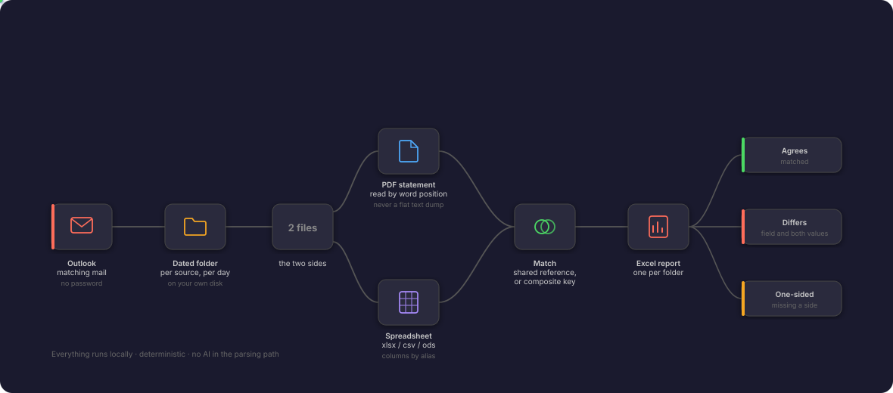

# statement-reconciler

**Two documents claim to describe the same money. This finds every place they disagree.**

A supplier bills you for a delivery nobody booked. Someone books a payment the supplier never
billed. The two land within a few pounds of each other, so the totals still foot, the month
closes clean, and the gap only surfaces a quarter later — when unpicking it means going back
through four months of statements by hand.

Reading line against line catches that on the day. It is also slow, repetitive work, and
attention starts to drift somewhere around the fortieth row.

So hand that pass over. Point this at a PDF statement and a spreadsheet listing the same records
— your own export, or a second outside party's file, since neither side has to be yours — and it
pulls both out of Outlook, files them into dated folders on your machine, and writes an Excel
report: what matched, what disagrees and by how much, and which side is missing what.

Everything runs locally on your machine. Nothing is uploaded anywhere, and there is no AI in the
parsing path -- the comparison is deterministic, so the same files always give the same answer.

---

## How It Works

<p align="center">
  
</p>

### 1. Pull the mail
Matching messages are found by subject fragments or attachment filename, and their attachments
saved. Access is through the Outlook desktop app you are already signed into — no password, no
app registration, nothing stored. It is a dry run unless you pass `--write`.

### 2. File it by day
Attachments land in a dated folder per source, on your own disk. `inventory` then answers the
question you ask before starting work: has everything actually arrived?

### 3. Read both sides
The PDF is read by **word position**, never a flat text dump — a dump collapses empty columns and
silently shifts a value into the wrong field. The spreadsheet is read through alias lists, so a
renamed column header is a config edit rather than a code change.

### 4. Decide what is the same record
If both sides carry a shared reference, records pair on it and every other field is compared.
If they carry none, records are identified by a combination of their own values instead. See
[How the comparison works](#how-the-comparison-works) for what that costs you.

### 5. Report it
One Excel workbook per folder: the verdict, what disagrees, what exists on only one side, and
anything that could not be read. `check --from/--to` adds a single overview across a whole week.

## Who this is for

You are in the right place if you can answer yes to all three:

1. **Someone outside sends you a PDF** listing transactions — a bank, a supplier, a processor,
   an insurer, a payroll provider.
2. **A spreadsheet lists the same transactions** — exported from your own system, or sent by a
   second outside party. Neither side has to be yours.
3. **Somebody currently checks the two against each other by hand**, or nobody does and that
   quietly worries you.

The job title varies; the shape does not. Two records of the same events disagree, and the gap
between them is where the money goes missing.

| You are | You compare | It catches |
|---|---|---|
| A **bookkeeper or treasury analyst** | the bank's daily statement against your cash ledger | a payment that left the bank but never posted; a transfer booked twice |
| An **accounting practice** | supplier statements against the purchase ledger | an invoice they billed and you never booked — and one you booked they never billed |
| An **online seller** | a payment processor's settlement against your orders | a refund settled but never recorded |
| A **payroll administrator** | the provider's remittance against the approved register | a leaver paid one cycle too long |
| An **insurance broker** | commission statements against your policy register | commission paid at the wrong rate, or on a lapsed policy |
| Anyone **holding two outside parties to each other** | a managing agent's statement against the letting platform's payout file | rent collected by one and never passed on by the other |

Each row has a ready-made config in [`examples/`](examples/EXAMPLES.md), with what typically
goes wrong and why it is set up that way.

### What your documents need

- **The PDF must have real text in it.** If you can select and copy a line of it in a PDF
  viewer, this works. A scan or a phone photo has no text to read, only pixels — there is no OCR
  here, and the tool will tell you it read nothing rather than pretend the day is clean.
- **The spreadsheet can be `.xlsx`, `.xlsm`, `.ods`, `.csv` or `.tsv`**, with a header row.
- **One side is the PDF, the other is the spreadsheet.** That is the pairing the tool reads.
- **Ideally both sides carry the same reference** — an invoice or transaction number. Not
  required, but it is the difference between "this invoice is out by 90.00" and "here are two
  rows, work out whether they are the same one."
- **Neither side has to be yours.** The common case is an external statement against your own
  export, but two files from two outside parties work identically. When neither is yours, name
  them with `labels:` so the report says "Managing agent statement" and "Platform payout file"
  rather than "document" and "spreadsheet" — see
  [`examples/configs/two_providers.yaml`](examples/configs/two_providers.yaml).

### See it work, without your own documents

```bash
pip install -e ".[dev]"
python examples/demo/build_demo.py
reconcile check --config demo/config.yaml "demo/ACME_SUPPLIES/ACME_SUPPLIES 2026.03.02"
```

That generates a supplier statement, a ledger disagreeing with it in three specific ways, and a
config joining them -- then shows the report it produces:

```
Matched:             2
Differing:           1     INV-4472 amount: 899.00 on the statement, 989.00 in the ledger
One-sided:           2     INV-4474 billed not booked; INV-4480 booked not billed
Verdict:             DIFFERENCES FOUND
```

Full walkthrough in [examples/EXAMPLES.md](examples/EXAMPLES.md).

## Install

Requires Python 3.11+. Fetching mail additionally requires Windows with the **classic** Outlook
desktop app -- the Microsoft Store "new Outlook" exposes no automation interface. The `check`
and `inventory` commands work on any platform, on files you already have.

```bash
git clone <this repo>
cd statement-reconciler
python -m venv .venv
.venv/Scripts/activate        # Windows;  source .venv/bin/activate elsewhere
pip install -e ".[dev]"
```

## Setup

Start from the example closest to your situation rather than from a blank file:

```bash
cp examples/configs/banking.yaml config.yaml   # five sectors in examples/EXAMPLES.md
# or start from the fully commented blank template:
cp config.example.yaml config.yaml
```

Then edit `config.yaml`. It is commented throughout; the four things to get right are:

**0. How records pair up.** If both files carry a shared reference, set `match_on` to that field
— you get far better reports. If they don't, use `match_key` instead. See
[How the comparison works](#how-the-comparison-works).

**1. How to recognise the mail.** A message matches a source if every fragment in `subject_all`
appears in the subject, *or* any fragment in `attachment_contains` appears in an attachment
filename. The second route is what catches a forwarded message, which keeps the file but loses
the original subject wording.

**2. Where the PDF's columns are.** Run:

```bash
reconcile probe statement.pdf --mask
```

That prints each word on page 1 with the x position it sits at, e.g. `AAAAA@110`. Look down the
page for where each column of values consistently starts and put those numbers into
`document.columns`. `--mask` replaces every character with its shape (`9` for a digit, `A` for an
uppercase letter), so you can share the output to get help without exposing any real value.

**3. What your spreadsheet calls each field.** Under `records`, list the possible column headers
for each field -- first one present in the file wins. If none match, the error tells you what it
tried and what the file actually has, so the fix is a config edit rather than a code change.

## Use

```bash
# See what would be downloaded. Writes nothing.
reconcile fetch --from 2026-03-02 --to 2026-03-06

# Actually save the attachments into their dated folders.
reconcile fetch --from 2026-03-02 --to 2026-03-06 --write

# Has everything arrived yet?
reconcile inventory --from 2026-03-02 --to 2026-03-06

# Cross-check one folder and write the report into it.
reconcile check "~/Statements/EXAMPLE_SOURCE/EXAMPLE_SOURCE 2026.03.02"

# Cross-check a whole range: every source, every weekday, one overview workbook.
reconcile check --from 2026-03-02 --to 2026-03-06
```

`fetch` is a dry run unless you pass `--write`. Copying files out of a mailbox onto disk should
be a deliberate choice, not something that happens because you mistyped a date.

`check` exits 0 when everything reconciles and 1 when it does not, so it slots into a script.

### Checking a whole week

`check --from/--to` is the one you will run each morning. It walks every source's folder across
the range, reconciles the ones that have both files, writes each folder's own report as usual,
and then writes a single `overview.xlsx` at the top of `output_root` — one row per source per
day, colour-coded, with the reason each row is not green:

```
  2026-03-02  ACME   RECONCILED
  2026-03-03  ACME   DIFFERENCES   1 differing
  2026-03-04  ACME   INCOMPLETE    missing spreadsheet
  2026-03-05  ACME   INCOMPLETE    folder does not exist
  2026-03-06  ACME   RECONCILED
5 run(s): 2 reconciled, 1 with differences, 2 incomplete, 0 failed.
```

Weekends are skipped. A folder that cannot be read at all is marked `FAILED` with the error and
the walk continues — one bad day must never hide the state of every other day.

There is also `reconcile folders --week 2026-03-02`, which creates the week's empty folders in
advance (weekdays only -- statements do not arrive on Saturdays, and weekend folders would show
up as permanently missing in the inventory).

## The report

`check` writes `reconciliation_report.xlsx` into the folder:

| Sheet | What it holds |
|---|---|
| **Summary** | Counts per side, totals, and the verdict |
| **Differences** | Records found on both sides that disagree — field, both values, where to look (`match_on` mode only) |
| **Unmatched** | Every one-sided record, saying which side has it and which is missing it |
| **Unread Lines** | Document lines the reader could not interpret |
| **Matched** | Every matched pair, with where each came from |

The verdict is **FULLY RECONCILED** only when nothing is one-sided, nothing disagrees, the counts
agree, *and* nothing was left unread. That last condition matters: a line the reader could not
interpret is not evidence of agreement, it is a record nobody checked. Calling that "reconciled"
would be the one failure mode that hides a genuine break. An ambiguous identifier blocks it for
the same reason.

## How the comparison works

First the tool decides which document record and which spreadsheet record are the *same record*.
There are two ways, and which one you get depends on your documents.

### By identifier -- `match_on` (preferred)

Most transactional documents carry a reference that appears on both sides: an invoice number, a
transaction id. Point `match_on` at that field and records pair on it, after which **every other
field is compared**. A wrong value is then reported as exactly what it is:

> `INV-4471` — amount is `1,234.50` in the document and `1,243.50` in the spreadsheet

That lands on a **Differences** sheet, one row per disagreeing field, with the page and row to
look at. Use this mode whenever an identifier exists.

### By composite key -- `match_key` (fallback)

Some documents carry no identifier at all. Then a record can only be recognised by a combination
of its own values -- typically date + description + amount + quantity.

The trade-off is real and worth understanding before choosing this mode: a record whose amount
differs between the two files shows up as *two one-sided records*, not one difference. With
nothing tying the two rows together, there is no way to know they were meant to be the same
record, and claiming otherwise would be a guess that hides which side is wrong. If your documents
do have an identifier, `match_on` avoids this entirely.

### In both modes

Values are normalised before comparing, so `1,234.50`, `1.234,50` and the float `1234.5` all
count as the same number, and `02-Mar-2026` matches `2026-03-02`. Formatting is never reported as
a difference; the report still shows you the original values, since that is what you will be
looking at in the two files.

Pairing is one-for-one on repeats. If the same record genuinely occurs twice on both sides, both
pair up; a third occurrence on one side alone is reported. In `match_on` mode an identifier that
appears more than once on either side is flagged as **ambiguous** rather than paired silently --
the pairing behind it would be a guess about which copy goes with which.

On the PDF side the tool reads word positions, never a flat text dump. A text dump collapses
empty columns, so a row with no quantity silently shifts its amount one field left and the
reconciliation then confirms a number that was never on the page.

## Extending the workflow

**Nothing below is built yet.** These are the two directions the workflow is designed to grow
in, written down so the shape is clear before anyone starts.

### Adding AI, if your organisation allows it

The reconciliation itself is deliberately deterministic — the same two files always produce the
same answer, and every verdict can be traced to a rule you can read. That is what makes the
output defensible to an auditor, so **AI should never decide whether two records match.** Keep
it outside that core, where it helps with the parts that are genuinely judgement:

| Where | What it would do | Why it is safe there |
|---|---|---|
| **Setting up a source** | Read a sample statement and propose `document.columns` and the spreadsheet aliases, as a draft config you review | It only writes config; you check it before it runs |
| **Explaining a break** | Turn "INV-4472: amount 899.00 vs 989.00" into "likely transposed digits — 89 vs 98" and group the week's breaks by probable cause | Suggestion only; the finding itself came from the deterministic engine |
| **Near-miss suggestions** | Where descriptions differ in wording but mean the same thing, propose the pairing for a human to confirm | Flagged as a suggestion, never auto-matched |
| **Writing the summary** | Draft the plain-language note that goes to a supplier or a manager | Human sends it |

**Before any of that, the policy question comes first.** Every option above sends document
contents somewhere. Three routes, in increasing order of what they require:

1. **Nothing leaves the machine.** Run a local model. Slower and less capable, but the data
   never moves, so in most organisations it needs no approval beyond installing software.
2. **Send shapes, not values.** The tool already has `mask_shape`, which turns `INV-4471` into
   `AAA-9999`. Enough for a model to infer layout and column positions; useless to anyone who
   intercepts it. Good enough for the config-drafting case.
3. **Send real content to a hosted model.** The most capable option and the one that needs
   sign-off — a data processing agreement, a check on where the provider trains on inputs, and
   usually a named approver. Do not start here.

Whichever route, the rule stays: AI proposes, the deterministic engine decides, and the report
still says which rule produced each finding.

### Adding a database

Today every run writes an Excel file into a folder, and the folders are the history. That is
deliberate — nothing to install, nothing to back up, and anyone can open the output. It stops
being enough as soon as you want to ask questions *across* runs:

- Has this supplier broken before, and how often?
- Is the same invoice unreconciled three weeks running?
- Which source costs us the most time each month?
- Who resolved this break, when, and what did they write?

None of those can be answered by a folder of workbooks. A store would sit **alongside** the
current output, not replace it — each `check` writes its report as now, and also appends the
run and its findings.

A sketch, deliberately small:

| Table | Holds |
|---|---|
| `runs` | one row per source per day: verdict, counts, when it ran |
| `findings` | one row per difference or one-sided record, linked to its run |
| `resolutions` | what a person decided about a finding, and when |

**SQLite by default** — a single file next to `output_root`, no server, no credentials, and it
travels with the folder tree. Postgres only when several people need to write at once. The
`resolutions` table is the part that actually changes the work: it turns the tool from something
that finds breaks into a record of what was done about them, which is usually what an audit
asks for.

## Privacy

- Everything runs on your machine; nothing is sent anywhere.
- Outlook access uses the desktop app you are already signed into -- no password, no app
  registration, no token stored on disk.
- `.gitignore` blocks `*.pdf`, `*.xlsx`, `*.csv` and `config.yaml`, so real documents and your
  real mail-folder names cannot be committed by accident.
- Every test fixture in this repo is synthetic and generated at run time.

## Development

```bash
pytest -q --cov=src --cov-report=term-missing
ruff check . && black --check .
```

The Outlook layer sits behind small protocols and is tested with fakes, so the whole suite runs
anywhere -- no mailbox and no Windows required.

## Layout

```
src/statement_reconciler/
  config.py          load and validate the YAML; every domain fact lives here
  normalize.py       date / number / text canonicalisation
  records.py         the one record type both readers produce
  matching.py        composite-key matching and the verdict
  check.py           one folder end to end
  report.py          the Excel workbook
  inventory.py       which folders are incomplete
  overview.py        reconcile a date range, one outcome per source per day
  cli.py             fetch | folders | check | inventory | probe

workflow-diagram.svg   the picture at the top of this file

examples/
  EXAMPLES.md        who uses this, what it catches, and how to adapt a config
  configs/           five ready-made configs, one per sector
  demo/              generates a working example you can run immediately
  documents/pdf.py       read a PDF by word position
  documents/tabular.py   read xlsx / xlsm / ods / csv / tsv
  mail/outlook.py        COM fetch, behind injectable protocols
  mail/naming.py         folder and filename rules, shared by fetch and inventory
```

## License

MIT.
